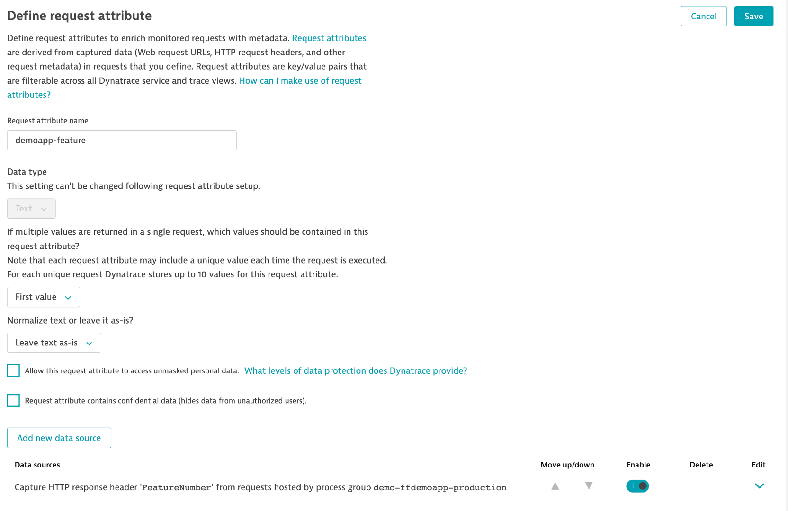

# Overview

This simple Node.JS app comes with built-in "feature" behaviors - meaning - if you launch the app and tell it to run as feature 1, 2, 3 to show slightly different behavior.  The web UI will change colors based on the enabled feature.

| Feature | Behavior | Color |
| ------- | -------- | ----- |
| 1 | Everything good | Green |
| 2 | 50% Failure Rate of /api/invoke | Red |
| 3 | Higher response times all requests | Yellow |

# Dynatrace

The demo app will put into the response a header called `FeatureNumber`.  With this, a Dynatrace [request attribute](https://www.dynatrace.com/support/help/how-to-use-dynatrace/services/request-attributes/capture-request-attributes-based-on-web-request-data) 

Shown below is the setup for Dynatrace request attributes. 



Dynatrace request attributes then allow the [Custom multidimensional analysis](https://www.dynatrace.com/support/help/how-to-use-dynatrace/diagnostics/multidimensional-analysis).


# Features

The application uses a default image of `img/banner.png`.  This can be overwritten by setting the `BANNER_IMAGE` environment variable to a file in the `img` folder or using a URL.

# Development

1. You must have [node installed](https://nodejs.org/en/download/) locally.
1. Once you clone the repo, you need to run `npm install` to download the required modules.  I used npm: '8.x',
  node: '16.x'
  
    ```
    # set environment variables, for example
    export BANNER_IMAGE=img/banner.png

    # only set if using LaunchDarkly
    export FEATURE_FLAG_PROVIDER=launchdarkly
    export FEATURE_FLAG_SDK_KEY=[your key]

    # update packages
    npm update

    # start app
    npm start
    ```

    Access the application @ http://localhost:8080/

# Build and Run

1. You must have Docker and Docker compose installed
1. Edit the environment variables values in the `docker-compose.yaml` file 
1. If using feature flags, then export the SDK Key read by the `docker-compose.yaml` file

    ```
    export FEATURE_FLAG_SDK_KEY=[your sdk key]
    ```

1. Build and run Docker image manually.  Run the `buildrun.sh` and `buildpush.sh` scripts.


# LaunchDarkly Setup

To use LaunchDarkly, then the following are required:
1. Under LaunchDarkly settings, add project and save the SDK Key
1. Add a Feature flag called `demoapp-feature` as shown below

1. Add environment variables locally or in `docker-compose.yaml` file set
    ```
    export FEATURE_FLAG_PROVIDER=launchdarkly
    export FEATURE_FLAG_SDK_KEY=[your sdk key]
    ```
